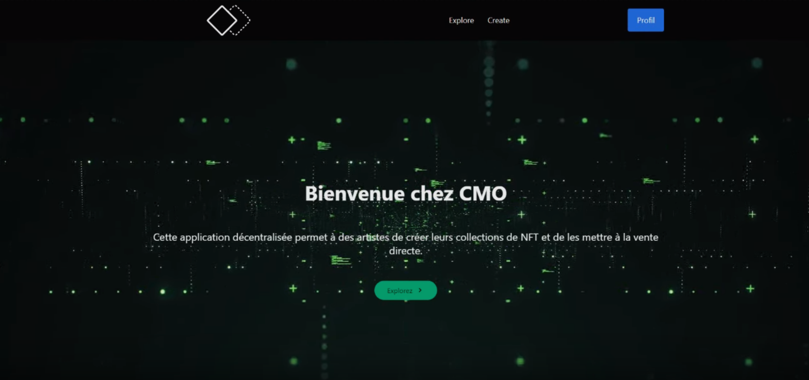
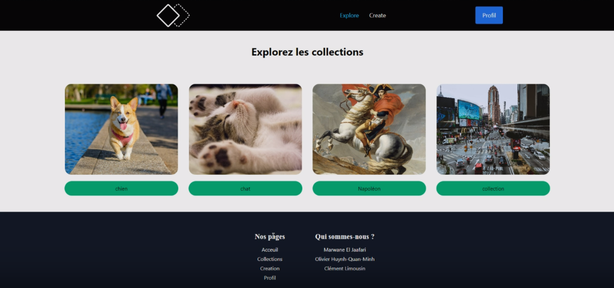

# Projet 4 - Marketplace NFT

## **Membres**
+ Olivier H.Q.M.
+ Clément L.
+ Marwane E.J.

## **Résumé**
Ce projet est une Marketplace NFT sur laquelle les utilisateurs peuvent :
+ Créer des collections de NFT d'après le **standard ERC721**.
+ Mint des NFT dans les collections qu'ils ont créées.
+ Vendre les NFT qu'ils ont créés.
+ Naviguer parmi toutes les collections de NFT créées sur la plateforme.
+ Acheter et revendre les NFT d'autres collections.

Le front a été réalisé en utilisant React.  
Le back a été réalisé à l'aide de Truffle.  

**Liens importants : ** 

+ [**Lien du site GitHub Pages**](https://raven254.github.io/Projet-4_Marketplace_NFT/)    
+ **Adresse du contrat Ropsten** : 0x5F36ad440A7c3e961F3683f3c4710b1331423914

## **Détail des fonctionnalités**
**Contrat NFT Factory**  
+ Mint des nouvelles collections de NFT.
+ Mint des NFT dans des collections déjà existantes. 

**Contrat MarketplaceNFT**  
+ Implémente NFTFactory et permet de mint des nouvelles collections de NFT et des NFT dans des collections déjà existantes.
+ Permet à un utilisateur de proposer un de ses NFT à la vente.
+ Permet à un utilisateur de retirer de la vente un NFT précédemment mis en vente.
+ ermet à un utilisateur d'acheter un NFT mis en vente.

+ Frais de la plateforme : 2,5%
+ Permet aux propriétaires définis (Olivier, Clément, Marwane) de retirer un montant défini à parts égales, dans la limite des fonds disponibles sur le contrat.

**Stockage des images**
Lors du mint d'une collection ou d'un nouveau NFT, l'utilisateur dépose une image :
+ L'image est envoyée et pinned sur IPFS via nft.storage.
+ Le service retourne un CID qui est transformé en URI par le front.
+ L'URI est utilisé par le contrat lors du mint du NFT.

**Première vidéo de présentation :** 

**Deuxième vidéo de présentation :**  

## **Tests unitaires**
39 tests réalisés.
Couverture globale des fonctions de MarketplaceNFT.sol (400 lignes de code).

## **Sécurité et Bonnes pratiques**
+ Ajout d'une fonction **Receive**.  
+ Ajout d'une fonction **Fallback**.  

## **Merci pour votre lecture**